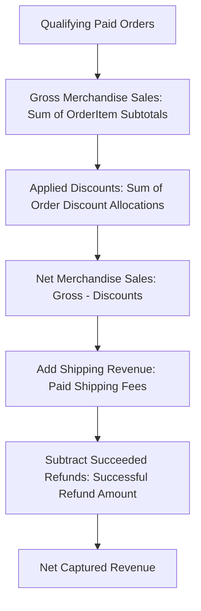

# RUPA Marketplace — Analytics & Reporting Architecture

## 1. Overview
Step 18 introduces an authoritative, read-oriented analytics and operational reporting layer over the existing transactional domain. It strictly avoids duplicating transactional models or mutating state for reporting convenience.

## 2. Core Architectural Principles
1. **Read-Oriented & Authoritative**: The analytics system queries the authoritative PostgreSQL commerce models directly (`Order`, `OrderItem`, `Payment`, `Refund`, `Return`, `Cancellation`, `Shipment`, `Inventory`, `Promotion`, `PromotionUsage`, `User`).
2. **Strict Timezone Semantics**: All date boundaries and calendar day aggregations default to `Asia/Tokyo` (UTC+9, JST).
3. **Integer JPY Currency**: All financial metrics strictly use integer arithmetic. No division or multiplication by 100, no floats, and no IDR.
4. **Historical Purchase Immutability**: All product sales and revenue calculations rely strictly on immutable historical `OrderItem` snapshots (`productName`, `productPrice`, `quantity`, `subtotal`, `discountAllocation`), remaining unaffected by any subsequent catalog price updates or product name changes.
5. **Customer Privacy Protection**: Aggregate reporting masks customer PII. No customer credentials, addresses, or phone numbers are exposed on aggregate dashboard views.
6. **No Fake Web Analytics**: Metrics requiring client-side behavioral event tracking (e.g. bounce rate, page session duration, website conversion rate) are explicitly omitted or marked unsupported from the transactional dataset.

## 3. High-Level Architecture Diagram

```mermaid
flowchart TD
    subgraph Transactional_Domain [Authoritative PostgreSQL Transactional Domain]
        Order[Order & OrderItem Snapshots]
        Payment[Payment & Webhook Events]
        Refund[Refund Records]
        Return[Return & ReturnItem Records]
        Cancellation[Cancellation Records]
        Shipment[Shipment & Tracking Events]
        Inventory[Inventory & Active Holds]
        Promotion[Promotion & PromotionUsage]
        User[User Records]
    end

    subgraph Analytics_Layer [Analytics & Reporting Layer]
        PeriodDomain[Analytics Period Domain: Asia/Tokyo UTC+9]
        FilterDomain[Sanitized Analytics Filters & Bounds]
        PrismaRepo[PrismaAnalyticsRepository: Aggregations & Zero-Normalization]
        AnalyticsService[AnalyticsService: DTO Compilation]
        CsvExportService[CsvExportService: Formula Injection Mitigation]
    end

    subgraph Admin_Presentation [Admin Operations Dashboard]
        AdminAnalyticsPage[Admin Analytics Page /[locale]/admin/analytics]
        KpiCards[KPI Summary Cards: Net Revenue, Orders, AOV, Refunds, Return Rate]
        TrendChart[Recharts Revenue Trend & Sales Chart]
        FunnelChart[Operational Order Funnel]
        ProductTable[Top Products Historical Performance]
        CategoryTable[Category Revenue & Volume]
        InventoryTable[Inventory Health & Low-Stock Monitor]
        PromoTable[Promotion Coupon Impact & Discounts]
        FulfillmentCard[Fulfillment Timings & Carrier Metrics]
        CustomerCard[Privacy-Preserving Customer Retention]
        CsvEndpoint[Export API /api/admin/analytics/export/:type]
    end

    Order --> PrismaRepo
    Payment --> PrismaRepo
    Refund --> PrismaRepo
    Return --> PrismaRepo
    Cancellation --> PrismaRepo
    Shipment --> PrismaRepo
    Inventory --> PrismaRepo
    Promotion --> PrismaRepo
    User --> PrismaRepo

    PeriodDomain --> AnalyticsService
    FilterDomain --> AnalyticsService
    PrismaRepo --> AnalyticsService
    AnalyticsService --> AdminAnalyticsPage
    AnalyticsService --> CsvExportService

    AdminAnalyticsPage --> KpiCards
    AdminAnalyticsPage --> TrendChart
    AdminAnalyticsPage --> FunnelChart
    AdminAnalyticsPage --> ProductTable
    AdminAnalyticsPage --> CategoryTable
    AdminAnalyticsPage --> InventoryTable
    AdminAnalyticsPage --> PromoTable
    AdminAnalyticsPage --> FulfillmentCard
    AdminAnalyticsPage --> CustomerCard
    CsvExportService --> CsvEndpoint
```

## 4. Sales Revenue Calculation Flow



## 5. Security & Formula Injection Mitigation
- **Server Authorization**: Every route (`/[locale]/admin/analytics`), Server Action (`getAnalyticsDataAction`), and export endpoint (`/api/admin/analytics/export/[type]`) strictly enforces `await requireAdmin()`.
- **CSV Formula Injection Mitigation**: Any string cell beginning with `=`, `+`, `-`, or `@` is prefixed with `'` during export formatting to prevent arbitrary code execution when opened in spreadsheet software.
