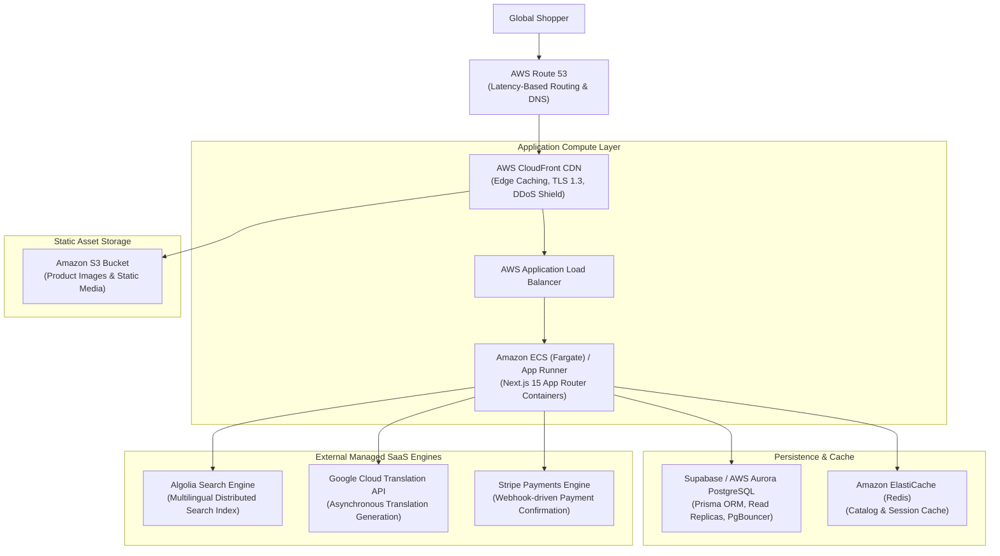

# AWS Production Architecture — RUPA Marketplace

This document outlines the **target** AWS cloud production topology for deploying the RUPA multilingual Asian marketplace. It is not a description of the current runtime: the current application uses Supabase PostgreSQL/Auth and has not yet been deployed onto this AWS topology. For the presentation-ready comparison and phased migration plan, see [`../marketplace-platform-team-presentation.md`](../marketplace-platform-team-presentation.md).

## AWS Services & Responsibilities

### 1. Route 53
- Anycast DNS with latency-based routing and automatic failover health checks.
- Directs global shoppers to the nearest AWS CloudFront edge location.

### 2. CloudFront
- Edge terminates TLS and caches static assets (images from S3, CSS/JS bundles).
- Forwards dynamic localized route requests (`/[locale]/...`) to the Application Load Balancer with client geo-location headers (`CloudFront-Viewer-Country`).

### 3. Amazon ECS (Fargate) / AWS App Runner
- Hosts containerized Next.js 15 standalone server instances.
- Auto-scales based on CPU/memory utilization and request throughput.
- Injected with server-only environment variables via AWS Secrets Manager:
  - `ALGOLIA_ADMIN_API_KEY`
  - `GOOGLE_TRANSLATE_API_KEY`
  - `DATABASE_URL`
  - `STRIPE_SECRET_KEY`

### 4. Supabase / AWS Aurora PostgreSQL
- Authoritative relational store containing canonical `Product`, `ProductTranslation`, `Category`, `Order`, and `Inventory` records.
- PgBouncer connection pooler in transaction mode for high concurrency.

### 5. Algolia Distributed Search
- Ingests multilingual `ProductSearchDocument`s containing aggregated `searchableNames` across all 8 languages.
- Delivers sub-50ms typo-tolerant search results globally.

### 6. Google Cloud Translation API
- Invoked strictly during administrative catalog authoring or batch translation sync.
- Never called in the critical user search path.
