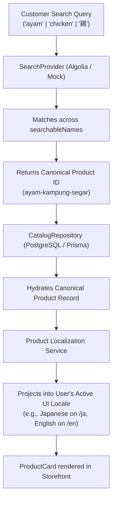

# Multilingual Search Architecture — RUPA Marketplace

This document details the high-level architecture of the **Multilingual Search & Product Discovery** domain for the RUPA marketplace.

## 1. Core Architectural Principle: Canonical Identity

In the RUPA architecture, a product represents a single commerce concept (e.g. `ayam-kampung-segar`) regardless of how many languages it is translated into.

- **One Canonical Product**: Stores language-independent attributes (Price in JPY, Stock, Available Qty, Reserved Qty, Ratings, Category ID, Image).
- **Multiple Child Translations**: One record per locale in `ProductTranslation` (`locale`, `name`, `description`).
- **One Search Document**: Indexed in Algolia (or MockSearchProvider) containing an aggregated `searchableNames` array containing all translated names across all 8 supported languages.



---

## 2. Supported Locales Matrix

The search engine indexes and discovers products seamlessly across all 8 supported marketplace locales:

| Code | Language | Example Product Name | Example Search Query |
|------|----------|----------------------|----------------------|
| `id` | Indonesian (Canonical Default) | Ayam Kampung Segar | `ayam` |
| `en` | English | Fresh Free-Range Chicken | `chicken` |
| `ja` | Japanese | 新鮮な地鶏（丸鶏） | `鶏` / `地鶏` |
| `tl` | Tagalog | Sariwang Katutubong Manok | `manok` |
| `vi` | Vietnamese | Gà Ta Thả Vườn Tươi | `gà` |
| `th` | Thai | ไก่บ้านสดทั้งตัว | `ไก่` |
| `hi` | Hindi | ताज़ा देसी मुर्गा (साबुत) | `मुर्गा` |
| `zh` | Chinese | 新鲜优质走地鸡（整只） | `优质走地鸡` / `鸡` |

---

## 3. Provider Abstraction Layer

All search and translation components are isolated behind clean provider interfaces:

```text
features/search/
├── domain/
│   ├── search-document.ts      # ProductSearchDocument & buildSearchDocument()
│   ├── search-query.ts         # SearchQueryInput & SearchProductsResult
│   └── search-result.ts
├── config/
│   └── search-config.ts        # Server-authoritative config & key isolation
├── providers/
│   ├── search-provider.ts      # SearchProvider & SearchIndexProvider interfaces
│   ├── algolia/
│   │   ├── algolia-client.ts   # Zero-dependency fetch-based REST client
│   │   ├── algolia-search-provider.ts
│   │   └── algolia-index-provider.ts
│   ├── mock/
│   │   └── mock-search-provider.ts # In-memory multilingual search engine
│   └── search-factory.ts       # Dynamic provider selection
└── services/
    ├── search-products.ts      # Search execution & canonical hydration
    ├── index-product.ts        # Single item index sync
    └── reindex-products.ts     # Full catalog reindex coordination
```

---

## 4. Security & Isolation Invariants

1. **Admin Key Server-Only**: `ALGOLIA_ADMIN_API_KEY` is strictly confined to server-side environments. It is never included in `NEXT_PUBLIC_*` variables or browser bundles.
2. **Server-Side Hydration**: Search queries return only canonical IDs; product pricing, stock availability, and promotion discounts are hydrated server-side from PostgreSQL to guarantee checkout integrity.
3. **Admin Reindex Authorization**: The admin reindex action (`reindexCatalogAction`) is protected with `requireAdmin()`.
