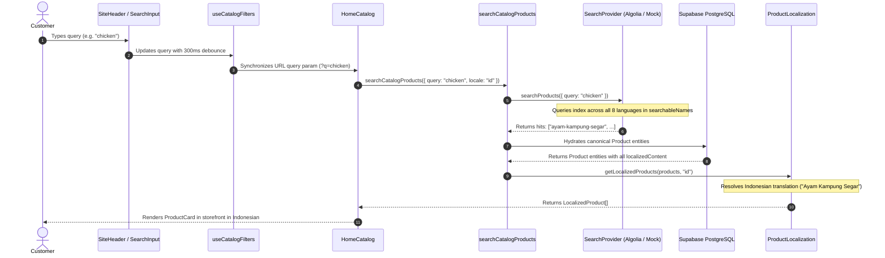

# Search Data Flow — RUPA Marketplace

This document describes the runtime execution flow when a user performs a search on the storefront.

## Key Invariants in Search Data Flow

1. **Client-Side Debouncing**: User typing is debounced at 300ms before router state updates, preventing request thrashing.
2. **URL Query Preservation**: Filter state is synced to the URL query string (`?q=...&category=...`), enabling shareable search links and browser history navigation.
3. **Locale Agnostic Querying**: Queries in Japanese, English, Indonesian, or any other supported language match the same canonical product.
4. **Active UI Locale Rendering**: The user's active browsing locale (e.g. `/id`, `/en`, `/ja`) determines how the product title and description are rendered on screen, regardless of what language the search query was typed in.
