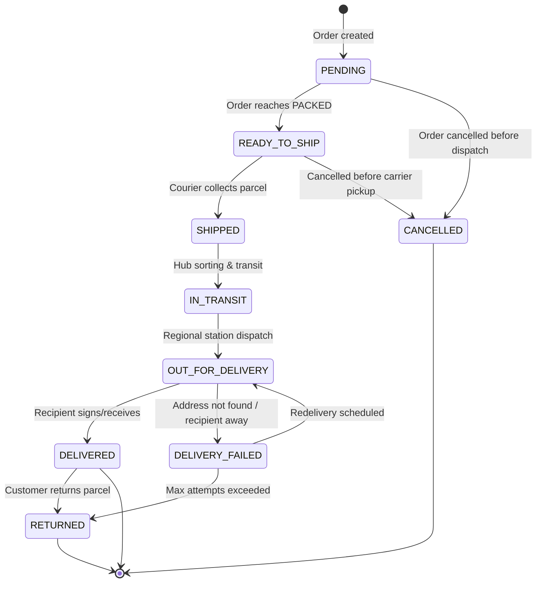

# Shipment Lifecycle & State Machine

## 1. Shipment State Transition Matrix

The `Shipment` state machine enforces strict, unidirectional progress and prevents illegal transitions (such as transitioning directly from `IN_TRANSIT` to `DELIVERED`, or backwards from `DELIVERED` to `SHIPPED`):



### Transition Validation Rules
- **No Direct Skip**: `IN_TRANSIT` must transition to `OUT_FOR_DELIVERY` before `DELIVERED`.
- **No Backward Movement**: `DELIVERED` cannot transition to `SHIPPED` or `IN_TRANSIT`.
- **Terminal States**: `RETURNED` and `CANCELLED` are terminal.
- **Idempotency**: Attempting a transition to the status the shipment is already in returns the current shipment without raising an error.

---

## 2. Order Synchronization

When a shipment changes state, it harmonizes with the `Order` state machine and logs to `OrderStatusHistory`:

| Shipment Transition | Order Status Before | Order Status After | Order Fields Updated | OrderStatusHistory Note |
| :--- | :--- | :--- | :--- | :--- |
| `→ READY_TO_SHIP` | `PAID` / `PACKED` | Unchanged | None | Shipment created via {provider} |
| `→ SHIPPED` | `PACKED` / `PROCESSING` | `SHIPPED` | `trackingNumber`, `shippedAt` | Order dispatched with tracking: {trackingNumber} |
| `→ IN_TRANSIT` | `SHIPPED` | `SHIPPED` | None | Webhook/Audit: In Transit |
| `→ OUT_FOR_DELIVERY`| `SHIPPED` | `SHIPPED` | None | Webhook/Audit: Out for Delivery |
| `→ DELIVERED` | `SHIPPED` | `DELIVERED` | `deliveredAt` | Parcel delivered to customer address |

---

## 3. Append-Only Tracking Events (`ShipmentTrackingEvent`)

Every status milestone produces a child database row:
```prisma
model ShipmentTrackingEvent {
  id          String   @id @default(cuid())
  shipmentId  String
  eventId     String?
  status      String
  description String?
  location    String?
  occurredAt  DateTime
  createdAt   DateTime @default(now())

  @@index([shipmentId])
  @@index([occurredAt])
  @@index([status])
  @@unique([shipmentId, eventId])
}
```

This guarantees an immutable audit log of real-world fulfillment milestones, queryable by customers and admins alike.
