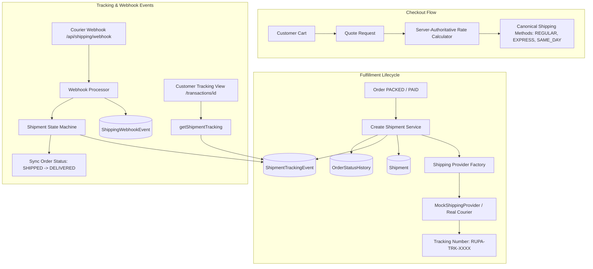

# Shipping Architecture & Courier Integration

## 1. Executive Summary

The RUPA Shipping Subsystem provides an extensible, courier-agnostic fulfillment and tracking platform for the multilingual Asian marketplace. It cleanly separates customer checkout rate computation, shipment record lifecycle management, courier tracking events, and order state synchronization.



---

## 2. Core Domain Entities & Relationships

```text
┌─────────────────┐       1:1        ┌──────────────────┐       1:N        ┌────────────────────────┐
│      Order      │ ───────────────> │     Shipment     │ ───────────────> │ ShipmentTrackingEvent  │
│                 │                  │                  │                  │                        │
│ id              │                  │ id               │                  │ id                     │
│ publicId        │                  │ orderId (unique) │                  │ shipmentId             │
│ status          │                  │ carrierName      │                  │ eventId                │
│ trackingNumber  │                  │ trackingNumber   │                  │ status                 │
│ shippingPrice   │                  │ status           │                  │ description            │
│ currency (JPY)  │                  │ shippingCost     │                  │ location               │
└─────────────────┘                  └──────────────────┘                  │ occurredAt             │
                                                                           └────────────────────────┘
```

### Domain Separation of Concerns
1. **`Order`**: Represents the commercial transaction between customer and marketplace (items, total amounts, financial payments, cancellations).
2. **`Shipment`**: Represents the physical packaging and courier dispatch assignment for an order. Created only when order reaches `PACKED` (or paid fulfillment eligibility).
3. **`ShipmentTrackingEvent`**: Append-only audit record of courier milestones (e.g., package created, in transit, out for delivery, delivered).
4. **`ShippingProvider`**: Interface defining communication with third-party courier services (quoting, shipment registration, tracking poll, webhook validation).

---

## 3. Server-Authoritative Shipping Rates

All shipping rates are computed on the server in canonical marketplace currency (**integer JPY**, no decimals):

| Method Code | Service Name | Cost (JPY) | Estimated Delivery | Description |
| :--- | :--- | :--- | :--- | :--- |
| `REGULAR` | Regular Delivery | **¥180** | 2–3 business days | Standard reliable courier delivery across Japan |
| `EXPRESS` | Express Courier | **¥360** | 1–2 business days | Priority overnight fulfillment with real-time tracking |
| `SAME_DAY` | Same Day Delivery | **¥520** | Same day (< 12:00) | Immediate metropolitan dispatch within Tokyo & Kanto |

Client-submitted shipping costs are strictly ignored and recalculated authoritatively on the server during `createOrderService`.

---

## 4. Courier Abstraction & Provider Extension Point

```typescript
export interface ShippingProvider {
  readonly providerName: string;
  getRates(input: GetShippingRatesInput): Promise<GetShippingRatesResult>;
  createShipment(input: CreateShipmentInput): Promise<CreateShipmentResult>;
  getTracking(input: { trackingNumber: string }): Promise<TrackingResult>;
  handleWebhook(
    payload: unknown,
    headers?: Record<string, string | string[] | undefined>
  ): Promise<ShippingWebhookResult>;
}
```

### Registered Providers
- **`MockShippingProvider`**: Deterministic local development provider generating `RUPA-TRK-XXXXXXXX` tracking numbers, multi-event simulated tracking data, and webhook parsers.
- **`DummyShippingProvider`**: Legacy test provider alias for test harness compatibility.
- **Real Courier Adapters (Yamato Kuroneko, Sagawa Express, Japan Post, DHL)**: Registered via `registerShippingProvider(name, providerInstance)` in `shipping-provider-factory.ts` without modifying existing order or catalog logic.
