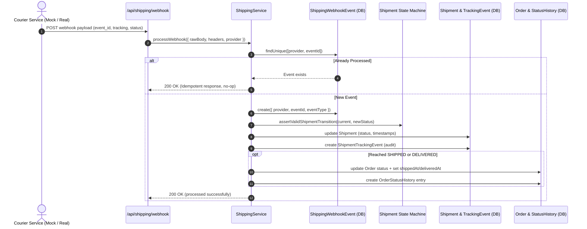

# Tracking & Webhook Flow Architecture

## 1. Flow Diagram



---

## 2. Webhook Deduplication & Idempotency

All webhooks are deduplicated at the database level using the `ShippingWebhookEvent` model:

```prisma
model ShippingWebhookEvent {
  id          String   @id @default(cuid())
  provider    String
  eventId     String
  eventType   String
  processedAt DateTime @default(now())

  @@unique([provider, eventId])
  @@index([provider])
}
```

If a courier service retries delivering the same webhook, the database composite constraint `[provider, eventId]` ensures that the payload is safely acknowledged with `{ received: true, processed: true, message: 'Idempotent: shipping webhook event already processed' }` without re-transitioning the shipment or corrupting historical audit rows.

---

## 3. Out-Of-Order Event Handling

If a webhook arrives late or out-of-order for a shipment that is already `DELIVERED`:
- The event is logged in `ShippingWebhookEvent` for deduplication.
- The shipment status remains `DELIVERED` without throwing an unhandled exception or degrading system state.

---

## 4. Manual Tracking Refresh (Admin Polling)

In addition to webhooks, admins can trigger an on-demand tracking refresh from `/admin/orders/[id]`:
1. Admin triggers `adminRefreshTrackingAction(orderPublicId)`.
2. System queries the courier provider's `getTracking()` endpoint.
3. Any new milestones are appended to `ShipmentTrackingEvent`.
4. If a newer status is detected, the state machine advances the shipment and order.
5. Cache is revalidated on `/admin/orders/[id]` and `/transactions/[id]`.
