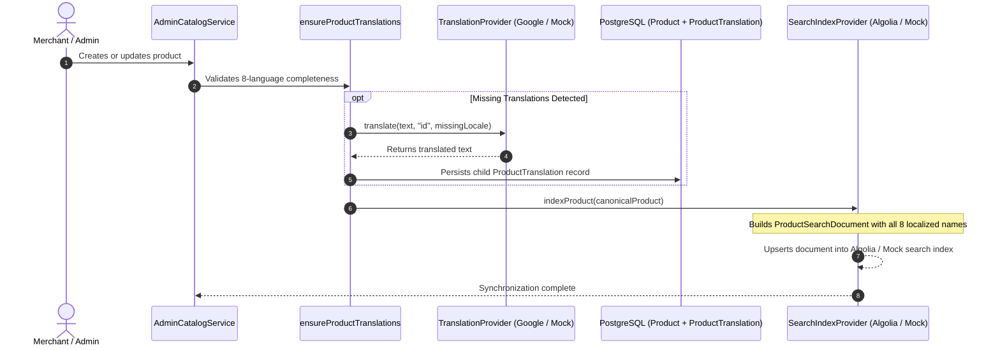

# Translation & Indexing Synchronization Flow — RUPA Marketplace

This document details how catalog changes and translations synchronize with the search engine index.



## Batch Reindexing Pipeline

In addition to event-driven single product indexing, full batch reindexing can be triggered at any time:

1. **CLI Execution**:
   ```bash
   npm run search:index
   ```
2. **Admin Operations Portal**:
   - URL: `/[locale]/admin/search`
   - Invokes `reindexCatalogAction()` server action protected with `requireAdmin()`.
   - Iterates through all active products, batches documents in chunks of 100, and updates the search index idempotently.
