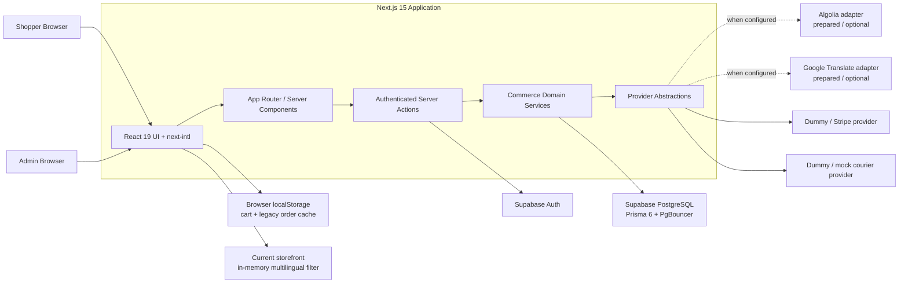
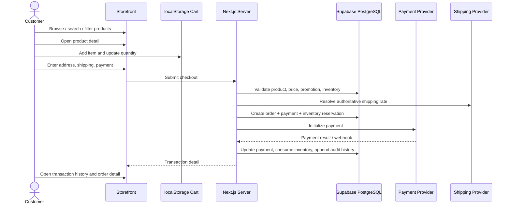
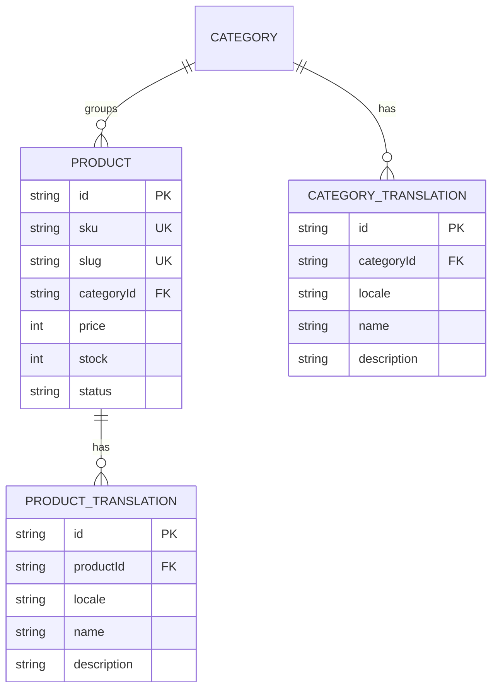
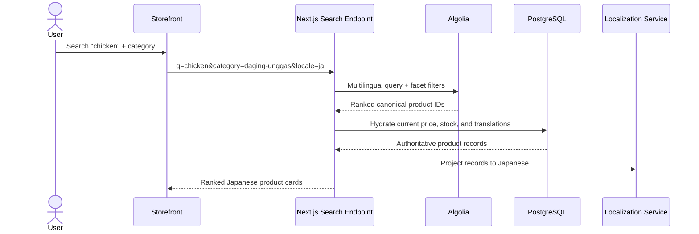
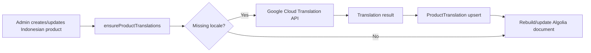
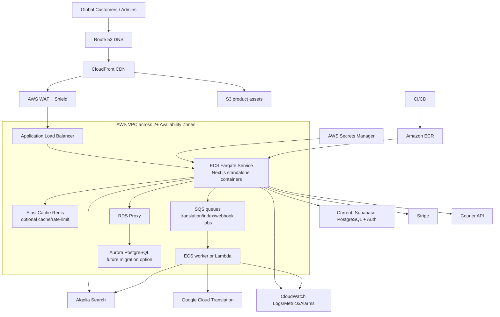

# RUPA Marketplace Platform

## Current Implementation, Multilingual Search, dan Target AWS Architecture

**Audience:** Product, Engineering, QA, DevOps, dan stakeholder bisnis  
**Status review:** 9 September 2026  
**Platform:** Marketplace demo yang telah berkembang menjadi modular commerce application

---

## 1. Executive Summary

RUPA sudah memenuhi flow utama marketplace dan dapat didemokan secara end-to-end: katalog, detail produk, cart, checkout, alamat, shipping, payment, order detail, riwayat transaksi, fulfillment, cancellation, return, dan refund.

Platform juga sudah mempunyai model data dan service untuk delapan bahasa—Indonesia, Inggris, Jepang, Tagalog, Vietnam, Thailand, Hindi, dan Mandarin—serta mekanisme pencarian lintas bahasa berbasis satu identitas produk canonical. Contohnya, `ayam`, `chicken`, `鶏`, `manok`, `gà`, `ไก่`, `मुर्गा`, dan `鸡` dapat mengarah ke produk canonical yang sama.

Namun, status production integration perlu disampaikan secara akurat:

> **Functional demo: complete. Production provider integration: prepared, tested with mock providers, but not yet activated end-to-end. AWS: target architecture, not the current deployment.**

UI katalog saat ini masih memfilter data produk yang sudah dimuat ke browser. Adapter Algolia, schema index, reindex workflow, dan service search sudah tersedia, tetapi UI storefront belum memanggil service Algolia. Google Cloud Translation juga sudah mempunyai provider dan persistence flow, tetapi konfigurasi aktif saat ini masih menggunakan fallback mock apabila credential production tidak tersedia.

---

## 2. Requirement Readiness Matrix

| Requirement | Status | Evidence / Catatan |
| --- | --- | --- |
| Product listing | ✅ Complete | Homepage mengambil katalog dari repository Prisma dan me-render localized product cards. |
| Product search | ✅ Demo / ⚠️ Production gap | Search dan category filter berfungsi secara client-side. Algolia service tersedia tetapi belum terhubung ke storefront. |
| Category filtering | ✅ Complete untuk demo | State disimpan di URL query parameter dan dapat dikombinasikan dengan keyword. Untuk production, category sebaiknya menjadi Algolia facet. |
| Product detail | ✅ Complete | Localized route `/{locale}/products/{id-or-slug}`. |
| Add to cart dan quantity controls | ✅ Complete | Cart tetap tersimpan di `localStorage` untuk pengalaman demo dan guest continuity. |
| Checkout, address, shipping, payment | ✅ Complete | Server melakukan authoritative pricing, shipping, inventory reservation, dan payment lifecycle. |
| Buy → transaction detail | ✅ Complete | Order tersimpan di PostgreSQL, lalu dapat dibuka melalui transaction detail. |
| Transaction history | ✅ Complete / hybrid | Database-backed order history dengan compatibility cache untuk legacy/local demo orders. |
| 8-language UI | ✅ Complete | Locale routing dan message catalog tersedia untuk `id`, `en`, `ja`, `tl`, `vi`, `th`, `hi`, `zh`. |
| Cross-language product discovery | ✅ Domain/service; ⚠️ storefront wiring | Search document menggabungkan seluruh nama terjemahan ke satu canonical product ID; telah diuji 41/41. |
| Algolia | ⚠️ Prepared, not active end-to-end | REST provider, index settings, batching, status page, dan admin reindex tersedia. Storefront masih memakai in-memory filtering. |
| Google Cloud Translation | ⚠️ Prepared, not confirmed active | Provider REST, missing-translation generation, DB upsert, dan reindex tersedia. Credential/provider production belum aktif di konfigurasi workspace. |
| Supabase PostgreSQL | ✅ Active current architecture | Prisma menggunakan Supabase PostgreSQL/PgBouncer sebagai authoritative commerce database. |
| AWS production deployment | 🟡 Designed, not deployed | Target topology dan service mapping tersedia pada dokumen ini. |

### Kesimpulan readiness

- **Siap untuk demo dan internal stakeholder review:** Ya.
- **Siap untuk pilot dengan data terbatas:** Ya, setelah environment production, monitoring, dan provider credentials dikonfigurasi.
- **Sudah memenuhi klaim “Algolia-powered storefront” dan “Google Translate aktif”:** Belum.
- **Sudah berjalan di AWS:** Belum; AWS masih berupa target architecture.

---

## 3. Current Actual Architecture



### Current runtime responsibilities

| Layer | Current technology | Responsibility |
| --- | --- | --- |
| Web application | Next.js 15 App Router, React 19, TypeScript | Localized pages, server rendering, server actions, API webhooks |
| UI system | Tailwind CSS 4, Base UI/shadcn patterns, Lucide icons | Responsive storefront dan admin interface |
| Localization | `next-intl` + 8 JSON message catalogs | Route locale, UI copy, localized rendering |
| Catalog data | Prisma repository | Canonical product/category data dan translations |
| Database | Supabase PostgreSQL | Orders, products, translations, payments, inventory, shipping, promotions, refunds, returns |
| Authentication | Supabase Auth + DB-backed application role | Session identity dan authoritative `CUSTOMER`/`ADMIN` role |
| Browser persistence | `localStorage` | Cart dan backward compatibility untuk demo/legacy orders |
| Search today | `filterProducts` in browser | Keyword + category filtering over the already-loaded multilingual catalog |
| Search prepared | Algolia REST providers | Query, filter, index settings, batch indexing, admin reindex |
| Translation prepared | Google Cloud Translation REST v2 provider | Generate missing translations, upsert DB records, update search index |
| Payment | Provider abstraction: Dummy dan Stripe | Payment initialization, verification, refund, webhook processing |
| Shipping | Provider abstraction: Dummy/mock courier | Rates, shipment lifecycle, tracking, webhook processing |
| Quality gates | TypeScript, Oxlint, executable TS integration suites | Domain invariants and regression verification |

---

## 4. Core Commerce Flow



### Data authority

- Browser state improves demo continuity but is not authoritative for price, stock, payment, shipping, refund, or role.
- PostgreSQL is the source of truth for all commerce records.
- Server services validate every lifecycle transition.
- Payment and shipping webhooks are persisted with provider event IDs for idempotency.

---

## 5. Multilingual Data Model



One product remains one business entity regardless of language. Language-independent attributes—ID, SKU, price, stock, category relation, image, and status—live on `Product`. Human-readable name and description live in `ProductTranslation`, with a unique `(productId, locale)` constraint.

### Supported locales

| Route code | Language | Example chicken query |
| --- | --- | --- |
| `id` | Bahasa Indonesia | ayam |
| `en` | English | chicken |
| `ja` | 日本語 | 鶏 / 地鶏 |
| `tl` | Tagalog | manok |
| `vi` | Tiếng Việt | gà |
| `th` | ภาษาไทย | ไก่ |
| `hi` | हिन्दी | मुर्गा |
| `zh` | 中文 | 鸡 / 走地鸡 |

---

## 6. Cross-Language Search Design

### Canonical search document

Every product produces one search record:

```json
{
  "objectID": "ayam-kampung-segar",
  "productId": "ayam-kampung-segar",
  "categoryId": "daging-unggas",
  "names": {
    "id": "Ayam Kampung Segar",
    "en": "Fresh Free-Range Chicken",
    "ja": "新鮮な地鶏（丸鶏）",
    "tl": "Sariwang Katutubong Manok"
  },
  "searchableNames": [
    "Ayam Kampung Segar",
    "Fresh Free-Range Chicken",
    "新鮮な地鶏（丸鶏）",
    "Sariwang Katutubong Manok"
  ],
  "available": true
}
```

Algolia mendukung satu index berisi atribut bahasa yang berbeda dan mengatur atribut tersebut melalui `searchableAttributes`. Category dan availability harus dinyatakan sebagai facets/filterable attributes agar filtering terjadi di search engine, bukan setelah semua data dikirim ke browser. Referensi: [Algolia multilingual search](https://www.algolia.com/doc/guides/managing-results/optimize-search-results/handling-natural-languages-nlp/how-to/multilingual-search), [searchable attributes](https://www.algolia.com/doc/guides/managing-results/must-do/searchable-attributes), dan [attributes for faceting](https://www.algolia.com/doc/api-reference/api-parameters/attributesForFaceting).

### Intended production flow



### Current gap to close

The storefront component currently calls `filterProducts` over `initialProducts`. To activate Algolia end-to-end:

1. Add a server action or route handler that calls `searchCatalogProducts`.
2. Debounce storefront queries and request the server search endpoint.
3. Render server results, loading, empty, and provider-error states.
4. Send category as the normalized `categoryId` facet.
5. Preserve URL state for shareable search results.
6. Configure `SEARCH_PROVIDER=algolia` and the Algolia credentials.
7. Run the authenticated admin reindex and verify index settings/count.
8. Add an end-to-end browser test proving `chicken`, `ayam`, and `鶏` return the same canonical item.

---

## 7. Translation Generation Flow

Google Translate should be an **authoring/indexing dependency**, not a dependency of each customer search request.



### Recommended production controls

- Translate only missing or explicitly stale locales.
- Store machine-translated content before serving it; never translate on the live search path.
- Record translation provider, timestamp, source locale, and review status in a future metadata extension.
- Allow human review for product names, regulated goods, cultural nuance, and SEO copy.
- Use retry/backoff and a dead-letter queue for failed translation/index jobs.

---

## 8. Target AWS Production Architecture

The recommended first production topology keeps Algolia, Google Translation, Stripe, and—during migration—Supabase as managed external services. AWS owns edge delivery, application compute, observability, secrets, async orchestration, and optionally the future database.



Amazon ECS on Fargate supports Application Load Balancers for HTTP/HTTPS workloads and dynamic container ports. Secrets Manager can inject scoped secrets into ECS tasks, with the operational caveat that rotated environment-variable secrets require a new task deployment. If the database later moves to Aurora PostgreSQL, RDS Proxy supplies managed connection pooling and multiplexing. References: [ECS load balancing](https://docs.aws.amazon.com/AmazonECS/latest/developerguide/service-load-balancing.html), [ECS Secrets Manager integration](https://docs.aws.amazon.com/AmazonECS/latest/developerguide/secrets-envvar-secrets-manager.html), and [RDS Proxy connection pooling](https://docs.aws.amazon.com/AmazonRDS/latest/AuroraUserGuide/rds-proxy.howitworks.html).

### AWS service map

| Concern | Recommended service | Why |
| --- | --- | --- |
| DNS | Route 53 | Domain management, health-aware routing |
| CDN and TLS edge | CloudFront + ACM | Cache static assets and reduce global latency |
| Edge protection | AWS WAF + Shield | Managed rules, rate limiting, DDoS protection |
| Container registry | Amazon ECR | Versioned application images |
| Next.js compute | ECS Fargate + ALB | Runs `output: standalone`, autoscaling, no server management |
| Product media | Amazon S3 + CloudFront | Durable object storage and global delivery |
| Current database | Supabase PostgreSQL + PgBouncer | Lowest migration risk for phase one |
| Future AWS-native DB | Aurora PostgreSQL + RDS Proxy | Multi-AZ managed PostgreSQL and pooled connections |
| Cache | ElastiCache Redis | Optional hot catalog cache, rate limiting, and ephemeral coordination |
| Async jobs | SQS + Lambda or ECS worker | Translation, indexing, retries, webhook processing |
| Scheduling/events | EventBridge | Reindex schedules and operational events |
| Secrets | Secrets Manager + task IAM roles | Central secret storage and controlled injection |
| Logs and metrics | CloudWatch | Application logs, dashboards, alarms |
| Tracing | OpenTelemetry/X-Ray | Cross-service latency and failure diagnosis |
| Audit/security | CloudTrail, GuardDuty, Security Hub | AWS control-plane audit and threat findings |
| CI/CD | GitHub Actions or CodePipeline/CodeBuild | Build, test, scan, publish to ECR, deploy ECS |
| Search | Algolia SaaS | Typo tolerance, ranking, multilingual attributes, facets |
| Translation | Google Cloud Translation API | Machine translation during content preparation |
| Payments | Stripe | Payment and refund provider with signed webhooks |
| Authentication | Supabase Auth initially; Cognito optional later | Avoid unnecessary auth migration in the first AWS phase |

---

## 9. Deployment Strategy

### Phase 1 — Production hardening with current database

1. Containerize the existing Next.js standalone output.
2. Deploy to ECS Fargate behind ALB, CloudFront, and WAF.
3. Keep Supabase PostgreSQL/Auth to minimize migration risk.
4. Store production secrets in Secrets Manager.
5. Add CloudWatch logging, health endpoints, alarms, and deployment rollback.
6. Configure Algolia and Google Translation production projects.
7. Wire storefront search to the server search service.

### Phase 2 — Async reliability and scale

1. Move translation and full reindex operations to SQS-backed workers.
2. Add retries, dead-letter queues, job status, and idempotency keys.
3. Add Redis only after measuring a repeatable cache or coordination need.
4. Introduce load tests for search, checkout, webhook bursts, and admin reindex.

### Phase 3 — Optional database migration

1. Benchmark current Supabase latency and connection-pool behavior.
2. Decide whether data residency, networking, cost, or operational ownership justifies Aurora.
3. Rehearse logical replication/export-import and application cutover.
4. Put RDS Proxy between ECS and Aurora and tune both client and proxy pools.
5. Keep a rollback window and reconcile orders/payments created during migration.

---

## 10. Security and Reliability Baseline

- Keep Algolia admin, Google Translation, Stripe secret, database, and service-role keys server-only.
- Give the storefront only server-mediated search access or a restricted Algolia search-only key.
- Validate Supabase JWTs server-side and resolve the application role from PostgreSQL.
- Verify signatures for payment and shipping webhooks and persist provider event IDs.
- Use least-privilege ECS task roles and separate execution/task IAM roles.
- Encrypt traffic with TLS and data at rest with managed keys.
- Back up PostgreSQL and rehearse point-in-time restore.
- Apply rate limits to login, search, checkout, webhook, and admin actions.
- Redact secrets and customer PII from logs.
- Alert on elevated payment failures, inventory conflicts, webhook retries, translation failures, search indexing drift, and database pool exhaustion.

---

## 11. Verification Evidence

| Suite | Result |
| --- | --- |
| Step 11 — Order lifecycle | 16/16 passed |
| Step 13 — Multilingual search | 41/41 passed |
| Step 14 — Shipping | 30/30 passed |
| Step 15 — Cancellation, refunds, returns | 81/81 passed |
| TypeScript | `npx tsc --noEmit` passed |
| Next.js production build | Completed successfully and generated 221 localized/static pages plus dynamic routes; repeated builds can be affected by transient Supabase pool availability during product pre-rendering |

What these tests prove:

- Domain services, mock providers, lifecycle transitions, multilingual canonical identity, and repository behavior work as designed.

What they do **not** yet prove:

- Live Algolia credentials and real index relevance.
- Live Google Translation quota, latency, and translation quality.
- Storefront-to-Algolia browser flow.
- AWS deployment, autoscaling, failover, WAF policy, or production observability.

---

## 12. Definition of Done for the Original Expectation

The project can be declared fully complete against the expanded production expectation when all items below pass:

- [x] Complete marketplace demo flow.
- [x] Eight localized UI routes and message catalogs.
- [x] Canonical product and translation schema in PostgreSQL.
- [x] Cross-language search document and provider abstraction.
- [x] Algolia indexing and admin reindex capability.
- [x] Google Translation provider and persistence flow.
- [ ] Storefront search calls Algolia-backed server search.
- [ ] Category filter uses Algolia facets in production mode.
- [ ] Production Algolia credentials, index, synonyms, ranking, and monitoring configured.
- [ ] Production Google Translation credentials, quota controls, retry policy, and human review workflow configured.
- [ ] End-to-end browser tests exercise live-like search and filtering.
- [ ] AWS infrastructure provisioned as code and deployed in at least staging.
- [ ] Monitoring, alarms, backups, recovery, load tests, and security review completed.

---

## 13. Suggested Team Presentation Flow

1. **Business goal:** one marketplace experience across eight Asian languages.
2. **Demo:** search `chicken`, `ayam`, and `鶏`; show one canonical product rendered in the selected UI language.
3. **Commerce journey:** cart → checkout → payment → transaction → fulfillment → return/refund.
4. **Current architecture:** Next.js + Supabase + provider abstractions.
5. **Honest readiness:** demo complete; Algolia/Google production activation remains.
6. **AWS target:** edge, container compute, async workers, observability, and optional Aurora migration.
7. **Decision request:** approve Phase 1 production hardening and storefront Algolia wiring.

---

## 14. Related Technical Documents

- [Multilingual search implementation](step-13-multilingual-search.md)
- [Multilingual search architecture](architecture/multilingual-search-architecture.md)
- [Search request/data flow](architecture/search-data-flow.md)
- [Translation and indexing flow](architecture/translation-indexing-flow.md)
- [Existing AWS production architecture](architecture/aws-production-architecture.md)
- [Order lifecycle](step-11-order-lifecycle.md)
- [Admin operations](step-12-admin-operations.md)
- [Shipping and tracking](step-14-shipping-and-tracking.md)
- [Returns, refunds, and cancellation](step-15-refunds-returns.md)
- [Promotions](step-16-promotions.md)
- [Catalog operations](step-17-catalog.md)
