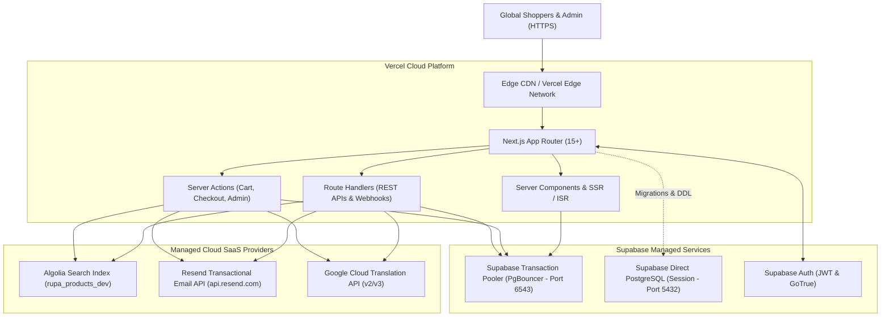

# RUPA Marketplace — Production Architecture

This document describes the production hosting, database, caching, search, email, and security topology for the **RUPA Multilingual Asian Marketplace**.

---

## 1. High-Level Topology

---

## 2. Responsibilities Matrix

| Platform / Service | Operational Domain | Key Responsibilities |
|---|---|---|
| **Vercel** | Application Compute & Edge | Hosting Next.js App Router, edge caching, serverless function scaling, environment variables, preview branch deployments, and production releases. Zero AWS hosting dependencies. |
| **Supabase (PostgreSQL)** | Persistent Relational Data | Authoritative database for users, catalog products, multi-locale translations, orders, payments, shipments, reservations, coupons, and historical audit trails. |
| **Supabase (Auth)** | Identity & Security | Authoritative user authentication, JWT session verification, password hashing, and user identity lifecycle. |
| **Prisma ORM** | Data Access Layer | Object-relational mapping, transaction boundaries (`tx.$transaction`), connection management via transaction pooler, and schema migrations. |
| **Resend** | Communications Delivery | Highly available transactional email dispatch across 8 supported locales (verification, password resets, order confirmations, shipping updates, refunds). |
| **Algolia** | Cross-Language Discovery | Sub-50ms lexical and typo-tolerant search across all 8 localized product names, resolving to single canonical product IDs. |
| **Google Cloud Translation** | Multilingual Localization | Automated backfill and on-demand translation of new catalog products and categories into unsupported target locales. |

---

## 3. Serverless Execution & Connection Pooling

Next.js functions on Vercel operate as stateless, short-lived serverless lambdas. To prevent PostgreSQL connection saturation:
1. **Transaction Pooler (Port 6543)**: All application queries and transactions flow through Supabase's transaction pooler with `pgbouncer=true` and explicit client pooling parameters (`connection_limit=15&pool_timeout=60`).
2. **Prisma Client Singleton**: `lib/prisma.ts` maintains a global singleton instance (`globalForPrisma.prisma = prisma`) persisting across invocations within reused container lifecycles.
3. **DDL & Migrations (Port 5432)**: Schema migrations and CLI commands run via `DIRECT_URL` on session-mode port 5432, completely segregated from query traffic.

---

## 4. Multilingual & Currency Invariants

- **Supported Locales**: 8 official languages (`id`, `en`, `ja`, `tl`, `vi`, `th`, `hi`, `zh`).
- **Marketplace Currency**: Authoritative integer Japanese Yen (`JPY`). All arithmetic is integer-based to eliminate floating-point rounding errors.
- **Canonical Product Representation**: Exactly one catalog record per product concept, linked to 8 localized translation rows.
