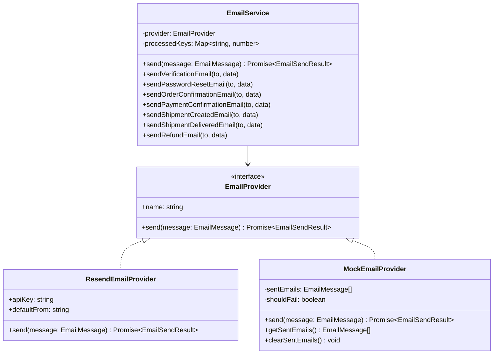

# Resend Transactional Email Guide — RUPA Marketplace

This document details the transactional email subsystem implemented for the RUPA Multilingual Asian Marketplace using **Resend**.

---

## 1. Subsystem Architecture

---

## 2. Supported Email Templates (8 Locales)

Each email template is localized into all 8 marketplace languages (`id`, `en`, `ja`, `tl`, `vi`, `th`, `hi`, `zh`) with both rich HTML and plain-text fallbacks:

| Template | Trigger Event | Key Dynamic Content |
|---|---|---|
| `verification.ts` | Customer sign-up / verification request | Verification link, expiry notice (24 hours) |
| `password-reset.ts` | Password reset request | Password reset link, security disclaimer |
| `order-confirmation.ts` | Order placed & pending payment | Order ID, items breakdown table, JPY subtotal, shipping fee, discount, total, address |
| `payment-confirmation.ts` | Payment confirmed (webhook or direct) | Order ID, amount paid (JPY), payment method, timestamp |
| `shipment-created.ts` | Admin / courier generates tracking | Courier name, tracking number, tracking portal URL |
| `shipment-delivered.ts` | Delivery confirmed by courier | Delivery timestamp, courier details, support prompt |
| `refund.ts` | Return completed or order cancelled | Refund ID, order ID, refunded amount (JPY), reason, banking turnaround notice |

---

## 3. Resilience & Idempotency Rules

1. **Non-Blocking Delivery**:
   - Critical commerce operations (such as order checkout, payment recording, and refund processing) execute inside database transactions.
   - Transactional emails are dispatched asynchronously after the database commit. If Resend experiences a network drop, a structured warning is logged, but the customer's order remains completed.
2. **Deduplication (`idempotencyKey`)**:
   - `EmailService` caches dispatch idempotency keys (e.g. `order_confirm_ORD-123`) for a 10-minute window.
   - Retried webhook events or customer page refreshes will not trigger duplicate emails.
3. **Mock Provider for Local Development**:
   - Setting `EMAIL_PROVIDER="mock"` routes all dispatches to `MockEmailProvider`, enabling offline testing and CI test assertions without incurring live Resend API charges or needing live API keys.
