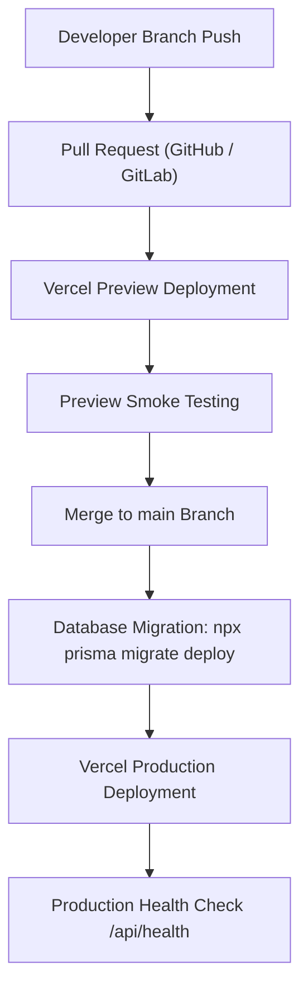

# Vercel Deployment Guide — RUPA Marketplace

This guide outlines the production deployment workflow, build commands, environment configuration, and rollback procedures for the RUPA Multilingual Asian Marketplace on **Vercel**.

---

## 1. Vercel Project Configuration

### Build & Output Settings
- **Framework Preset**: Next.js
- **Root Directory**: `./`
- **Node.js Version**: `22.x` (or `>=22.13.0`)
- **Build Command**: `npm run build`
- **Install Command**: `npm install`
- **Output Directory**: `.next` (automatic)

### Package.json Scripts
```json
{
  "scripts": {
    "dev": "next dev",
    "build": "next build",
    "start": "next start",
    "postinstall": "prisma generate"
  }
}
```
*Note: `postinstall: "prisma generate"` automatically generates the Prisma Client whenever Vercel installs dependencies.*

---

## 2. CI/CD Deployment Workflow



### Database Migration Deployment Rule
> [!IMPORTANT]
> **Production Migrations**:
> Run migrations against production using:
> ```bash
> npx prisma migrate deploy
> ```
> **NEVER** run `prisma migrate dev` or `prisma db push --force-reset` on preview or production environments.

---

## 3. Environment Strategy: Preview vs Production

Vercel provides native Environment Variable scoping:

| Variable Name | Environment: Preview | Environment: Production | Purpose |
|---|---|---|---|
| `NEXT_PUBLIC_SITE_URL` | `https://[branch]-[project].vercel.app` | `https://rupa.asia` (or custom domain) | Base site URL for redirects & links |
| `NEXT_PUBLIC_APP_ENV` | `preview` | `production` | Environment flag |
| `DATABASE_URL` | Staging Supabase Pooler (Port 6543) | Production Supabase Pooler (Port 6543) | Transaction pooler with `pgbouncer=true` |
| `DIRECT_URL` | Staging Direct DB (Port 5432) | Production Direct DB (Port 5432) | Direct connection for DDL migrations |
| `RESEND_API_KEY` | Test/Development API key | Production API key (`re_...`) | Email delivery |
| `RESEND_FROM_EMAIL` | `RUPA Staging <staging@rupa.asia>` | `RUPA Orders <orders@rupa.asia>` | Sender address |
| `ALGOLIA_INDEX_NAME` | `rupa_products_preview` | `rupa_products_prod` | Dedicated search index per environment |

---

## 4. Rollback Procedures

If an issue occurs after deploying to production:
1. **Instant Vercel Instant Rollback**:
   - Navigate to the **Vercel Dashboard** > **Deployments**.
   - Locate the previous successful deployment.
   - Click the three dots menu `...` > **Instant Rollback**.
   - Traffic switches to the previous deployment artifact within seconds.
2. **Database Rollback Caution**:
   - Because RUPA utilizes additive, non-breaking Prisma migrations, earlier code versions remain compatible with newer schema columns.
   - If a rollback requires reverting a migration, create an explicit forward-rolling migration script (`npx prisma migrate dev --name revert_...`).
